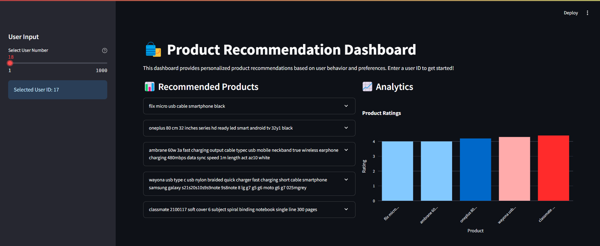
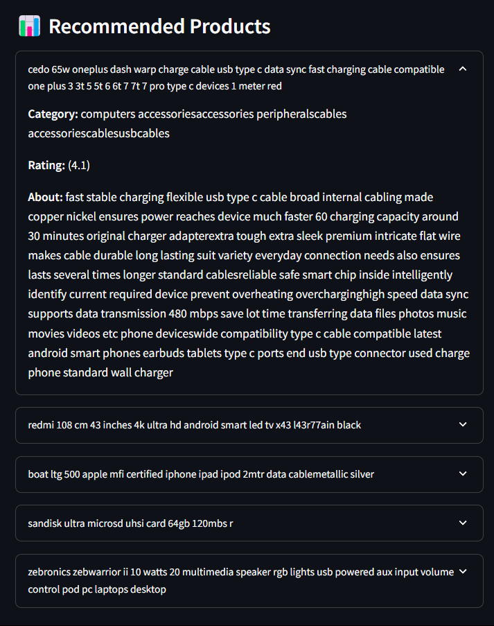
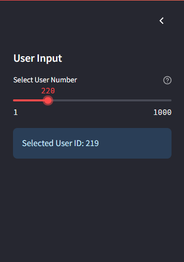
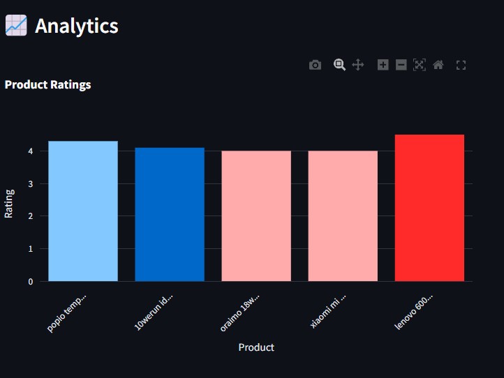

# Overview
A hybrid recommendation system that combines content-based and collaborative filtering approaches to provide personalized product recommendations. The system analyzes product details, user ratings, and review data to suggest relevant items to users.
## Features
- Content-based filtering using product details and reviews
- Collaborative filtering using user-item interactions
- Hybrid recommendation approach combining both methods
- Extensive data preprocessing and cleaning
- Detailed exploratory data analysis (EDA)
- Performance evaluation metrics
- Interactive Dashboard with streamlit to generate recommendations based on user-id

## Dataset
The system uses an Amazon Sales Dataset with the following key features:
- Product information (ID, name, category, price [actual and discounted])
- User reviews and ratings
- Product descriptions
- Category hierarchies

# Usage
### Step 1
You can clone this repository locally using CLI or download it as a zip file.
```bash
git clone
```
### Step 2
Now, you need to create an Anaconda environment:
- First, ensure you have Anaconda downloaded and setup on your computer.
- Next, open Anaconda prompt, and navigate to the folder `Recommender-System`.
- Create an Anaconda environment using the command below.
```bash
conda create --name Recommender-System
```
This will create an environment with name Recommender-System.
### Step 3
Activate the environment for further commands
```bash
conda activate Recommender-System
```
Now setup the dependencies for the project
```bash
conda env update --file environment.yml
```
This should install and setup all the dependencies.

### Step 4
After they have finished installation, download the Collaborative Filter Model and Content Based Similarity Matrix from the links below


Extract the models to the main working directory.

So far, your working directory should look like this:

```
Recommender-System
 |
 +-- cfmodel.pkl
 |    
 +-- cosine_matrix.npz
 |    
 +-- amazon.csv
 |    
 +-- environment.yml
 |    
 +-- app.py
 |
 +-- recommender_model.py
 |
 +-- preprocess.py         
```
### Step 5
Now inside the conda environment, run this command
```bash
streamlit run app.py
```
This should start up the streamlit app in your local browser.
Happy Shopping!

# Technical Details

## Dependencies
```python
python
pandas
numpy
matplotlib
seaborn
scipy
scikit-learn
nltk
surprise
streamlit
plotly
conda
```

## Data Preprocessing
- Text cleaning and normalization
- Handling missing values
- Price formatting
- Category hierarchy splitting
- Rating weight calculation
- Label encoding for user and product IDs

## Recommendation Approaches

### Content-Based Filtering
- Used TF-IDF vectorization for product details
- Computed cosine similarity between products
- Recommended products based on item-item similarity

### Collaborative Filtering
- Implemented SVD (Singular Value Decomposition)
- Used the Surprise library for model training
- Cross-validation for model evaluation

### Hybrid System
- Combines content-based and collaborative filtering scores
- Weighted recommendation scores
- Configurable weights for each approach

## Performance Metrics
- RMSE (Root Mean Square Error)
- MAE (Mean Absolute Error)
- Average Precision Score

# Challenges
- The dataset had a unique format, where each product had comma separated user values.
- Splitting the user values often led to many predictions being the same item, but from different users.
- Going from experimenting in Colab to modularizing the code.
- Debugging the errors in the streamlit dashboard.

# Screenshots




